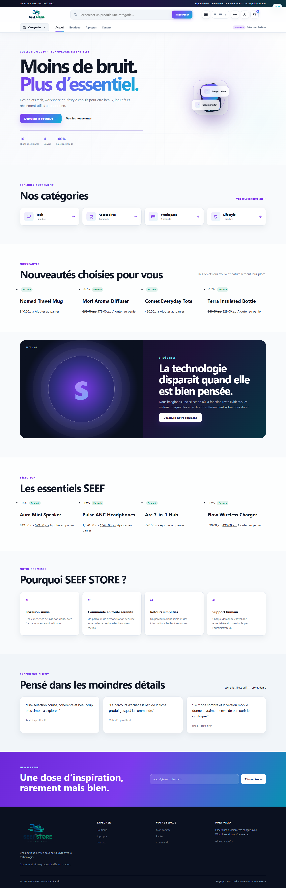
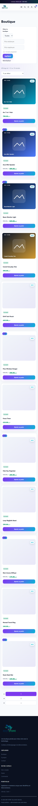
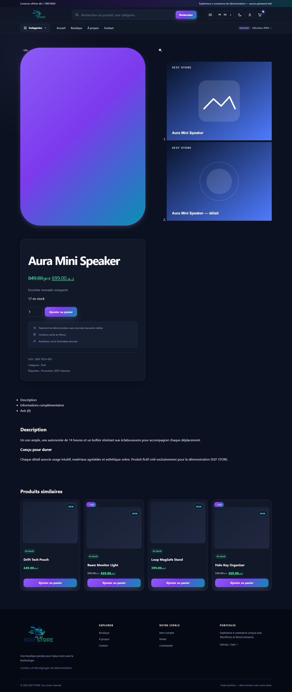
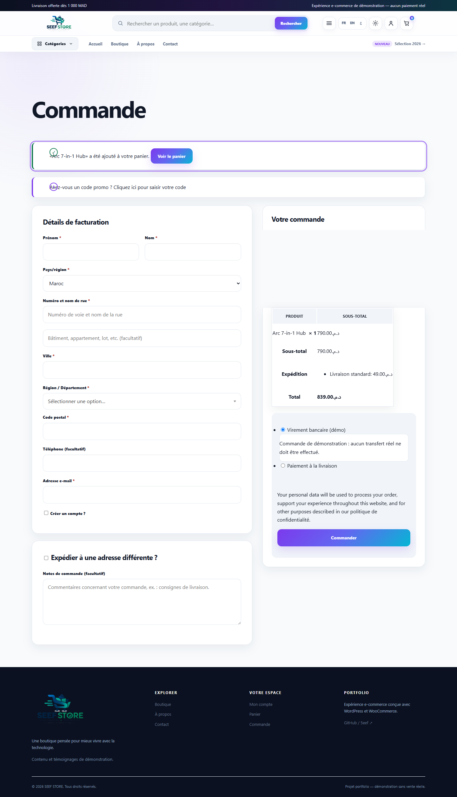
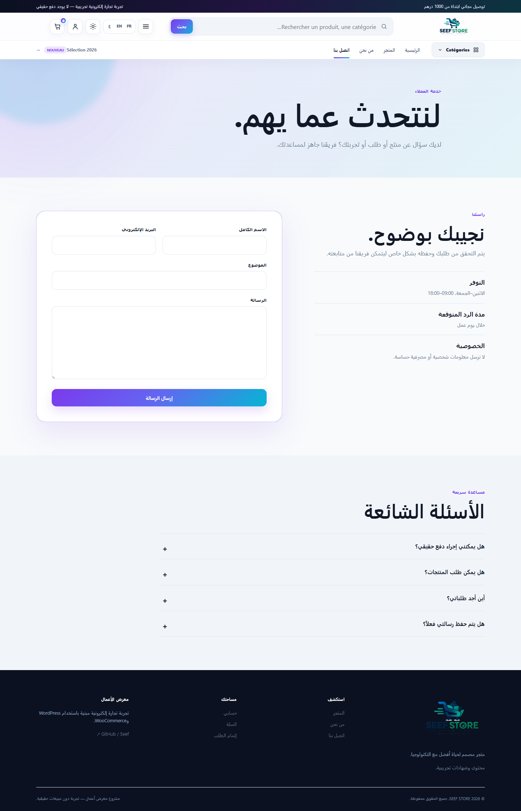

# SEEF STORE — expérience e-commerce WordPress

SEEF STORE est une boutique WooCommerce trilingue conçue comme projet portfolio full-stack. Le projet associe une identité visuelle originale, un thème WordPress sur mesure et un plugin métier pour proposer un parcours complet : catalogue, recherche, filtres, panier, commande, compte client, contact et administration.

**Conception et développement : Youssef BOUGHIOUL** — [GitHub @5eef](https://github.com/5eef)

**Démo en ligne : [seef-store.free.nf](https://seef-store.free.nf)** — hébergement portfolio gratuit sur InfinityFree.

> Démonstration uniquement : la marque, les produits, les témoignages, les paiements et les livraisons sont fictifs. Aucune transaction réelle ne doit être effectuée.

## Aperçu

- expérience responsive de 320 px à 1920 px ;
- modes clair et sombre persistants ;
- français, anglais et arabe avec mise en page RTL ;
- 16 produits, catégories, promotions, stocks, attributs et galeries ;
- recherche produit, filtres, tri, pagination et recommandations ;
- panier, checkout, commandes HPOS et espace client WooCommerce ;
- formulaires contact et newsletter sécurisés et persistants ;
- interface accessible au clavier et respect de `prefers-reduced-motion` ;
- SEO technique intégré : métadonnées sociales, données structurées, URLs lisibles et sitemap WordPress ;
- icônes SVG locales, sans police externe ni CDN.

## Choix techniques

| Couche | Technologie |
|---|---|
| CMS | WordPress 7.x |
| E-commerce | WooCommerce 11.x |
| Backend | PHP 8.1+, API WordPress/WooCommerce |
| Données | MariaDB/MySQL, commandes HPOS |
| Frontend | HTML sémantique, CSS variables, JavaScript natif |
| Environnement local | Apache + XAMPP |

Le thème ne réimplémente pas WooCommerce : les produits, stocks, clients, paniers et commandes restent gérés par ses APIs officielles. Le plugin `seef-store-core` isole les fonctions métier, la validation, la sécurité, la traduction et l’administration.

## Architecture

```text
wp-content/
├── themes/seef-store/          # thème, templates et design system
└── plugins/seef-store-core/    # services métier et administration
docs/                           # architecture, sécurité, tests et déploiement
tests/                          # tests PHP et smoke tests HTTP
tools/                          # installation locale reproductible
```

Documentation détaillée : [architecture](docs/ARCHITECTURE.md), [base de données](docs/DATABASE.md), [sécurité](docs/SECURITY.md), [tests](docs/TESTING.md).

## Installation locale

Prérequis : XAMPP, PHP 8.1+, Apache avec `mod_rewrite`, MariaDB/MySQL et les extensions PHP `curl`, `fileinfo`, `mbstring`, `mysqli`, `openssl`, `xml`, `zip`.

1. Placer le projet dans `C:\xampp\htdocs\WordPress\my_first_store_wordpress`.
2. Démarrer Apache et MySQL depuis XAMPP.
3. Créer la base `my_first_store_wordpress` si elle n’existe pas.
4. Initialiser le projet :

```powershell
$env:SEEF_ADMIN_USER = 'votre_admin_local'
$env:SEEF_ADMIN_PASSWORD = 'un-mot-de-passe-local-fort'
C:\xampp\php\php.exe tools\bootstrap-wordpress.php
$env:SEEF_DEMO_MODE = 'true'
C:\xampp\php\php.exe tools\configure-store.php
```

Si `SEEF_ADMIN_PASSWORD` est omis, le bootstrap génère un mot de passe fort et l’affiche une seule fois dans le terminal. Le seeding est refusé sans `SEEF_DEMO_MODE=true` et hors environnement WordPress `local`/`development`; une activation normale du plugin ne crée ni ne reconfigure aucune donnée.

5. Ouvrir `http://localhost/WordPress/my_first_store_wordpress/`.

Les paramètres de connexion peuvent être remplacés avec `SEEF_DB_NAME`, `SEEF_DB_USER`, `SEEF_DB_PASSWORD` et `SEEF_DB_HOST`. Les identifiants de test sont documentés séparément dans [docs/DEMO.md](docs/DEMO.md) et ne doivent jamais être réutilisés en ligne.

## CI / Quality

Le workflow GitHub Actions `.github/workflows/ci.yml` contrôle chaque pull request et chaque push sur `main`. Il limite le PHP lint au thème, au plugin, aux tests et aux outils propriétaires, exécute les tests autonomes, vérifie le JavaScript custom et analyse l’historique Git avec Gitleaks. Un job séparé initialise WordPress/WooCommerce sur une base MariaDB jetable, active le mode démo uniquement en environnement de développement, vérifie HPOS puis lance les tests d’intégration et les smoke tests HTTP portables.

Validation locale :

```powershell
C:\xampp\php\php.exe tests\run-integration.php
C:\xampp\php\php.exe tests\theme-helpers.php
C:\xampp\php\php.exe tests\unit.php
C:\xampp\php\php.exe tests\demo-mode-safety.php
powershell -ExecutionPolicy Bypass -File tests\http-smoke.ps1
C:\xampp\php\php.exe tests\http-smoke.php
C:\xampp\php\php.exe tests\contact-http.php
C:\xampp\php\php.exe tests\admin-http.php
```

La suite vérifie notamment le catalogue, les stocks, le panier, les totaux, la création de commandes, les nonces, le contact, les langues, le RTL et les principaux en-têtes de sécurité.

## SEO et mise en production

Le thème fournit des descriptions contextuelles, les URLs canoniques des archives WooCommerce, Open Graph, Twitter Cards et un schéma `OnlineStore`. WordPress complète les canoniques des contenus et le sitemap ; WooCommerce ajoute les données structurées produit.

L’installation locale reste volontairement en `noindex`. Avant la publication, il faut remplacer les URLs locales, activer l’indexation, utiliser HTTPS, désactiver le debug et créer de nouveaux comptes. La procédure complète couvre aussi l’archive de release sans tests, secrets, `wp-config.php` ni `.htaccess` local dans [docs/DEPLOYMENT.md](docs/DEPLOYMENT.md).

## Captures d’écran



*Accueil en mode clair — viewport 1440 px.*



*Catalogue responsive — viewport 375 px.*



*Fiche produit réelle en mode sombre.*



*Checkout WooCommerce avec un produit de démonstration.*



*Page contact en arabe avec mise en page RTL.*

## Auteur

**Youssef BOUGHIOUL**  
GitHub : [github.com/5eef](https://github.com/5eef)

## Licence

Projet portfolio. WordPress et WooCommerce conservent leurs licences respectives. Les visuels et données de démonstration ne représentent aucun commerce réel.
